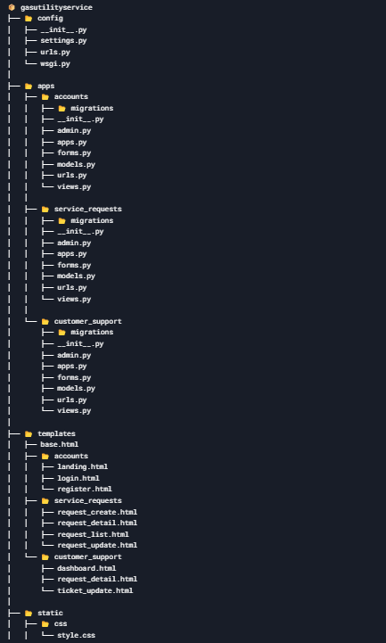

# 🚀 Gas Utility Service

## 🌟 Project Overview
The **Gas Utility Service** is a Django-based web application designed to manage service requests for a gas utility company. It allows customers to:
- Create and track service requests.
- Support representatives can manage and resolve these requests efficiently.

---

## 📂 Project Structure

Below is the structure of the Django application:



---

## 🔄 Workflow

### 1. **User Authentication**
- Users can register and log in using the `accounts` app.
- After logging in, users are redirected to their respective dashboards based on their roles:
  - **Customer Dashboard**: For customers to manage their service requests.
  - **Support Dashboard**: For support representatives to handle and resolve requests.

### 2. **Service Requests**
- Customers can:
  - Create new service requests using the `service_requests` app.
  - Provide details such as type, priority, description, and optional attachments.
  - View the status of their requests and update them if necessary.

### 3. **Customer Support**
- Support representatives can:
  - View all service requests.
  - Update their statuses (e.g., "In Progress," "Resolved").
  - Add resolution notes and mark requests as resolved.

### 4. **Admin Management**
- Admin users can:
  - Manage users, service requests, and other data through the Django admin interface.

---

## 🛠️ How to Run the Project

### 1. **Clone the Repository**
```bash
git clone https://github.com/your-username/Gas_Utility_Service.git
cd Gas_Utility_Service
```

### 2. **Create and Activate Virtual Environment**
```bash
python -m venv venv
source venv/bin/activate  # On Windows: venv\Scripts\activate
```

### 3. **Install Dependencies**
```bash
pip install -r requirements.txt
```

### 4. **Apply Migrations**
```bash
python manage.py makemigrations
python manage.py migrate
```

### 5. **Create Superuser**
```bash
python manage.py createsuperuser
```

### 6. **Run the Server**
```bash
python manage.py runserver
```

### 7. **Access the Application**
- **Admin Panel**: [http://127.0.0.1:8000/admin/](http://127.0.0.1:8000/admin/)
- **Login Page**: [http://127.0.0.1:8000/accounts/login/](http://127.0.0.1:8000/accounts/login/)

---

## ✨ Features

### 🔑 **User Authentication**
- Login, registration, and role-based access.

### 📝 **Service Request Management**
- Create, view, update, and resolve service requests.

### 🛠️ **Customer Support Dashboard**
- Manage and resolve customer issues.

### 🛡️ **Admin Panel**
- Full control over users and data.

---

## 💻 Technologies Used

| **Technology** | **Description** |
|-----------------|-----------------|
| **Backend**     | Django          |
| **Frontend**    | HTML, CSS, Bootstrap |
| **Database**    | SQLite          |
| **Authentication** | Django's built-in authentication system |

---

## 🚀 Future Enhancements

- Add **email notifications** for service request updates.
- Implement **search and filter** functionality for service requests.
- Add support for **multiple languages**.

---

## 📜 License

This project is licensed under the MIT License. See the `LICENSE` file for details.

---

## 📧 Contact

For any inquiries or feedback, feel free to reach out:
- **Email**: vivekshahare23@example.com
- **GitHub**: [VivekShahare04](https://github.com/VivekShahare04)

---

## 🎉 Thank You for Using Gas Utility Service!
We hope this application makes managing service requests easier and more efficient. Happy coding! 🚀


